# 🚀 Azure Capstone Project (Flask + Azure Storage + Application Gateway + Traffic Manager)

## 📌 Project Overview

This project demonstrates a complete end-to-end cloud web application deployed on **Microsoft Azure** using multiple services like:

- Flask Web Application
- Azure Virtual Machines
- Azure Virtual Networks (VNets)
- VNet Peering
- Azure Blob Storage
- Application Gateway (Multi-region)
- Traffic Manager (Global Load Balancing)

The system supports:
- Home page and Upload page hosted on VMs
- File upload to Azure Blob Storage
- High availability using multi-region deployment
- Global routing using Traffic Manager

---

## 🧰 Prerequisites

- 4 Virtual Machines
- 2 Virtual Networks (VNets)
- VNet Peering
- Azure Storage Account (Blob Storage)
- 2 Application Gateways (Central US & West US)
- Traffic Manager Profile
- Flask application scripts

---

## 🏗️ Architecture Overview

The architecture is designed for **high availability, scalability, and fault tolerance**.

📷 Architecture Diagram:

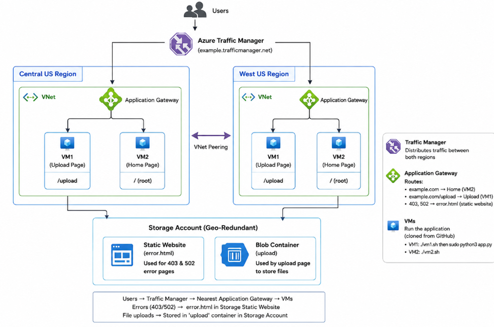

---

## ☁️ Azure Resources Setup

### 📦 Resource Group
- Name: `capstone-project`

---

### 🌐 Virtual Networks

- VNet-1 → Central US  
- VNet-2 → West US  
- VNet Peering configured between VNet-1 and VNet-2

📷 VNet Peering:

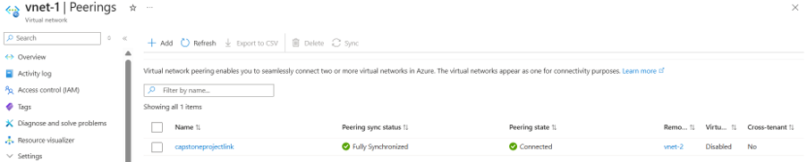

---

## 🖥️ Virtual Machines Setup

### Central US
- VM1 → Upload Page
- VM2 → Home Page

### West US
- VM1 → Upload Page
- VM2 → Home Page

---

## 💾 Azure Storage Account

- Storage Type: Blob Storage
- Container Name: `upload`
- Access Level: Configured for public/static access
- Static Error Page enabled using `error.html`

📷 Storage Account:

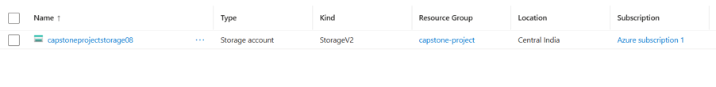

📷 Blob Container:

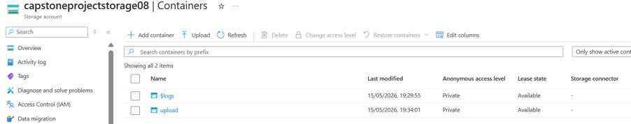

📷 Static Website:

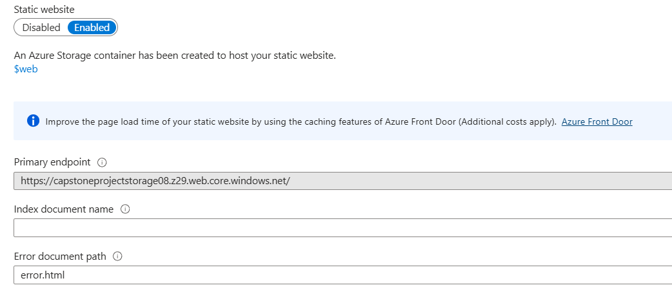

---

## 🌐 Application Gateway

### 1️⃣ Central US Application Gateway

- Listener configured
- Backend Pool added
- Routing Rules configured

📷 Overview:
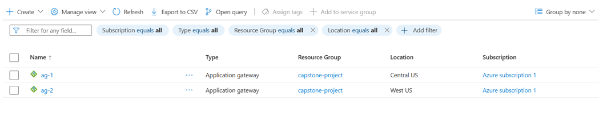

📷 Listener:
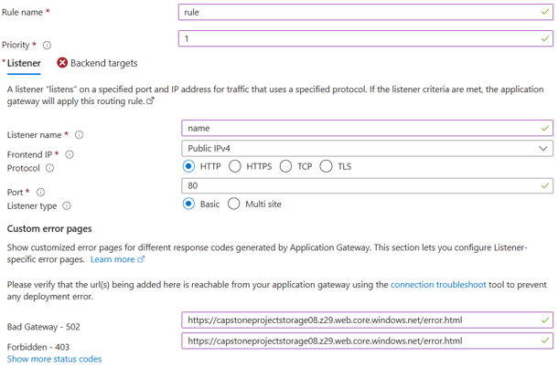

📷 Backend Pool:
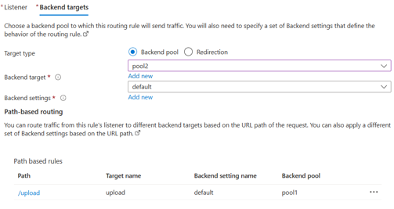

📷 Routing Rule:
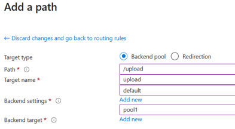

---

### 2️⃣ West US Application Gateway

(Same configuration as Central US)

---

## 🌍 Traffic Manager

- Used for global routing between regions
- DNS-based load balancing
- Ensures high availability

📷 Traffic Manager:

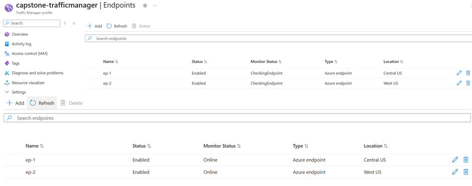

---

## 🧪 Application Deployment Steps

### 1️⃣ Update VM
```bash
sudo apt update
```

---

### 2️⃣ Clone Repository
```bash
git clone https://github.com/azcloudberg/azproject.git
cd azproject
```

---

### 3️⃣ Configure Storage
```bash
sudo nano config.py
```

(Add Storage Account Name + Access Key)

---

### 4️⃣ Run Application

- VM1 → Home Page  
- VM2 → Upload Page  

```bash
sudo python3 app.py
```

---

## 📤 File Upload Flow

1. Open Traffic Manager DNS  
2. Navigate to:

```
/upload
```

3. Upload file  
4. File stored in Azure Blob Storage    

---

## 📷 Application Screenshots

### Home Page
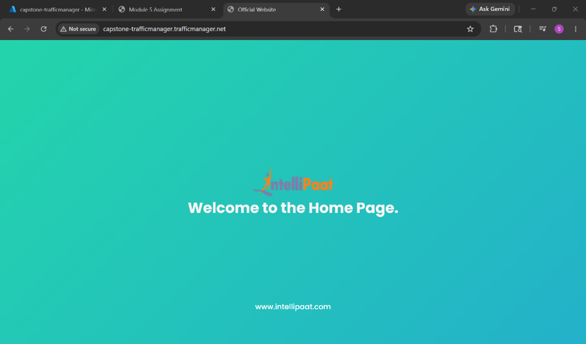

### Upload Page
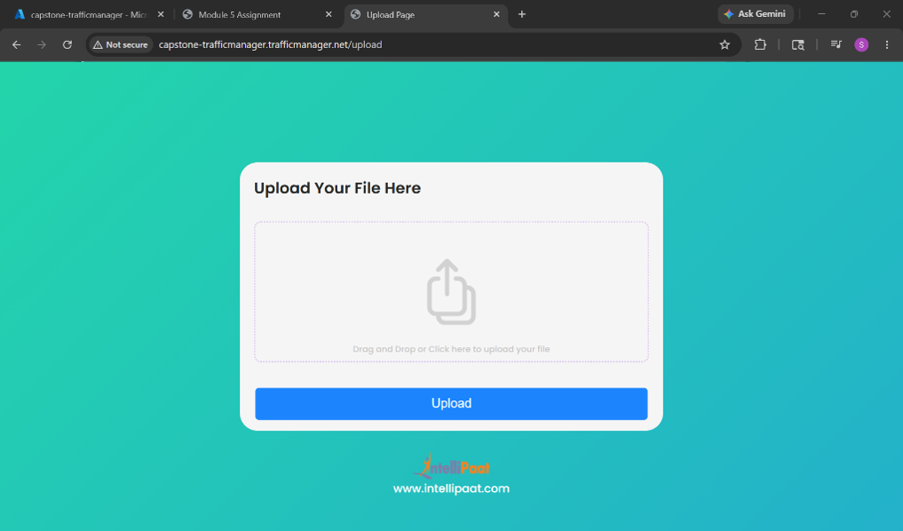

### Flask Running
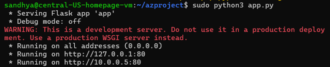

---

## 🎯 Final Outcome

- Multi-region deployment working  
- High availability using Traffic Manager  
- Secure file upload to Azure Blob Storage  
- Fully functional Flask cloud application  

---

## ✅ Project Status

✔ Completed Successfully  
✔ End-to-end Azure Deployment  
✔ Production-style architecture implemented  
